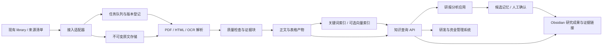

# 总体架构设计

## 目标与范围

在现有资料接入与卡片系统上增加全文、可追溯证据、检索接口、带引用分析和长期研究记忆。生成流水线可重复、可恢复、可增量升级。人的研究判断保留历史和控制权。初始工程不替换 library 或 Syncthing，不部署交易执行系统。

核心成功标准：任何检索命中或研究结论可返回当时引用的源版本和位置；同源同版本同配置重复运行不产生重复；部分失败不会破坏已发布索引；新版原文不使旧引用失效。

## 逻辑拓扑

## 数据面与控制面

数据面保留原文、分块正文、表格、索引、引用和研究记录。控制面维护接入游标、任务状态、幂等键、租约、质量告警、预算和发布版本。解析 worker 不直接覆盖当前可查询版本；发布器在验证通过后切换 active generation。

## 初始技术选择

- 服务端 Python 模块化单体；后续 HTTP 层采用 FastAPI 候选，实现时锁定版本。
- SQLite 保存元数据、任务与 FTS5 索引；单节点单一发布者，worker 可并行解析。中文使用版本化分词适配器，不能直接依赖默认 unicode61。
- 不可变原文及正文产物使用本地文件存储，路径由内部身份生成，禁止将外部标题当作路径。
- PDF 文字层、HTML DOM 和本地 OCR 使用可替换适配器；样本测评后确定依赖。复杂版式工具列为候选而非预先承诺。
- embedding 是后续可选层，与正文处理解耦。索引和向量可从正文重建。
- 定时器每小时发现变化并入队；实际运行进程在服务器，不用聊天自动化替代生产任务调度。
- SQLite 规模触发升级条件：实测并发写争用、索引耗时或 P95 延迟超出指标，再评估 PostgreSQL/专用搜索服务；不以资料数单独判断。

## 模块边界

|模块|输入|输出|负责|
|---|---|---|---|
|ingestion|清单/事件|来源版本、任务|兼容现有身份、游标、去重|
|storage|字节及哈希|不可变对象|完整性、历史版本、访问权限|
|extraction|原文版本|正文、布局、表格|PDF/HTML/OCR 路由|
|quality|解析产物|质量状态|乱码、遗漏、重复、数字与版式问题|
|indexing|合格证据块|索引 generation|分词、发布、重建|
|retrieval|查询和身份|证据结果|筛选、排序、时间约束|
|api|客户端请求|版本化响应|鉴权、配额、契约|
|analysis|问题及证据集合|带引用草稿|可选 LLM、引用验证|
|memory|草稿及确认|研究记录版本|状态、反证、决策来源|
|vault|允许的成果|Markdown|生成区写入与人工区保护|
|jobs|任务状态|重试与调度|租约、恢复、限流|
|observability|任务和调用事件|指标与审计|错误、成本、质量|

## 写入与迁移边界

P1-P3 在新运行目录建立影子产物，现有卡片服务继续工作。新服务采用 `/api/kb/v1/` 路径，不复用现有 `/api/v1/search` 的语义。发布后卡片可以增添正文状态和证据链接，由现有生成器升级负责，不由新服务随意覆盖整张卡片。

Obsidian 分为来源目录、自动研究候选、人工研究与复盘。新增生成路径必须登记；人工区不存在“全文件覆盖”权限。生成文件记录 owner、生成器版本、内容哈希，检测手工变动后产生冲突候选。

## 长期约束

保留源版本、提取版本和索引版本三条独立版本链。研究结论可以失效，但旧结论及依据仍可回看。文档内容视为研究数据，不能授予文档内文字执行指令或工具权限。知识服务向资金系统提供证据与研究信号，不在本工程直接下单。
